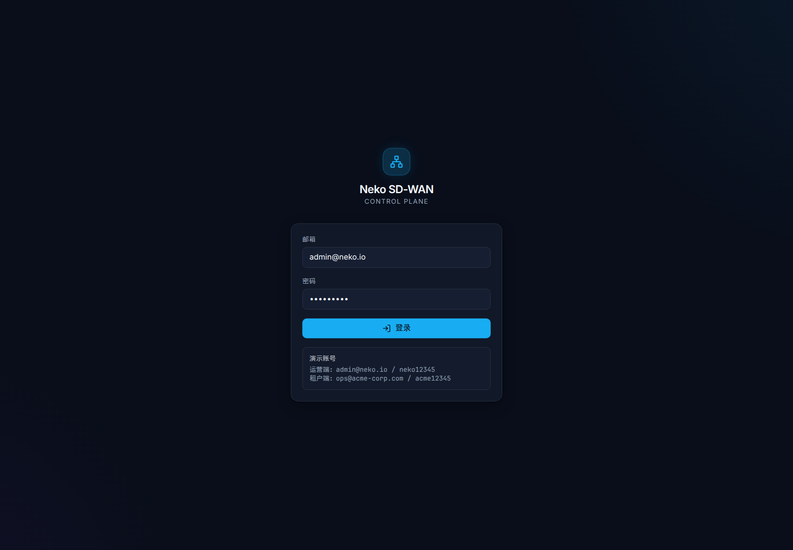
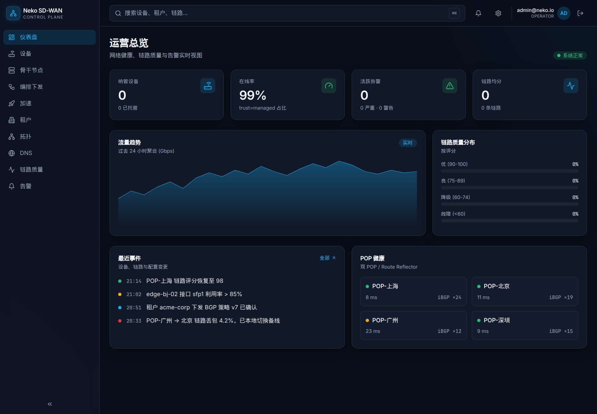
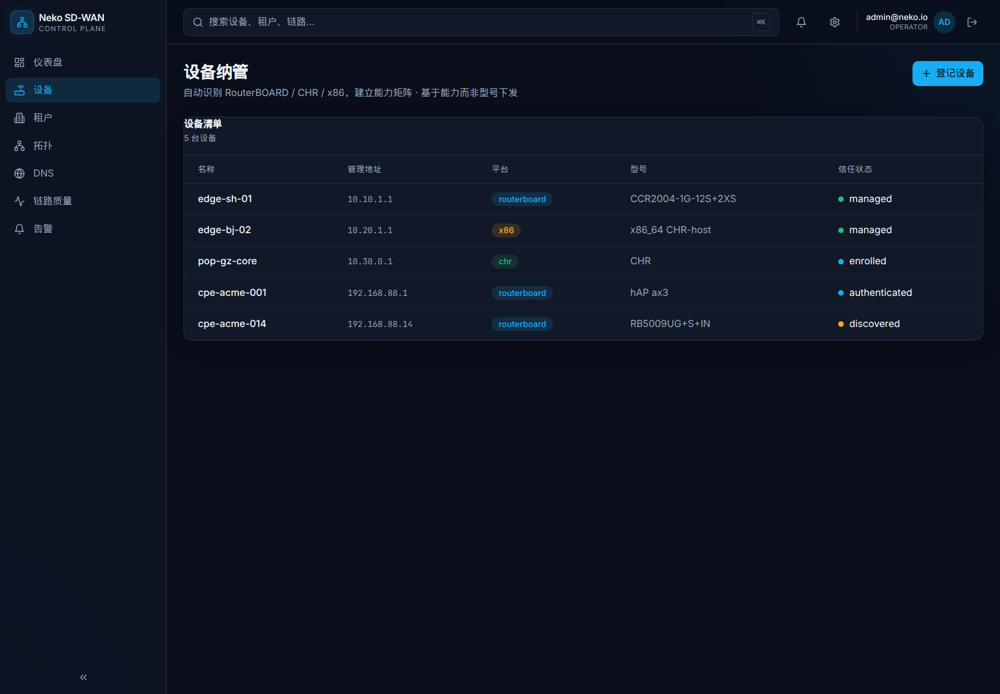
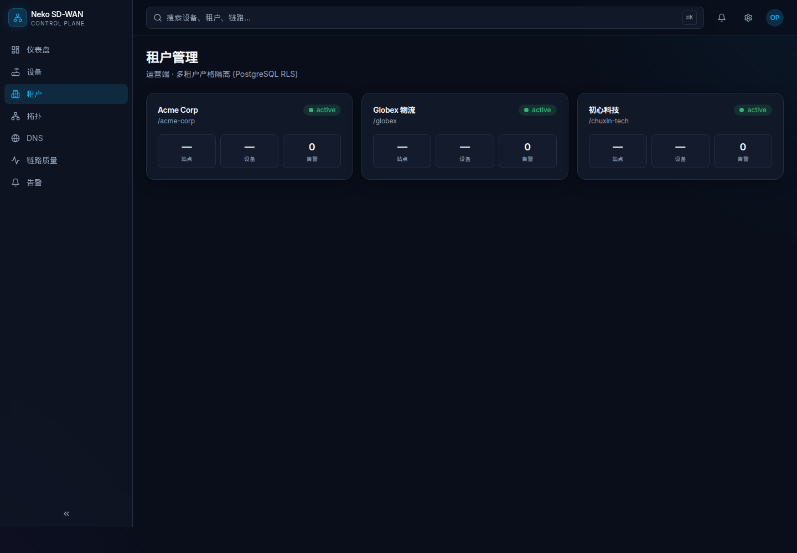
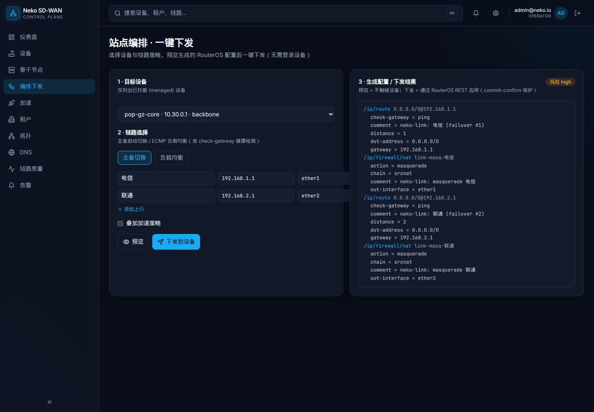
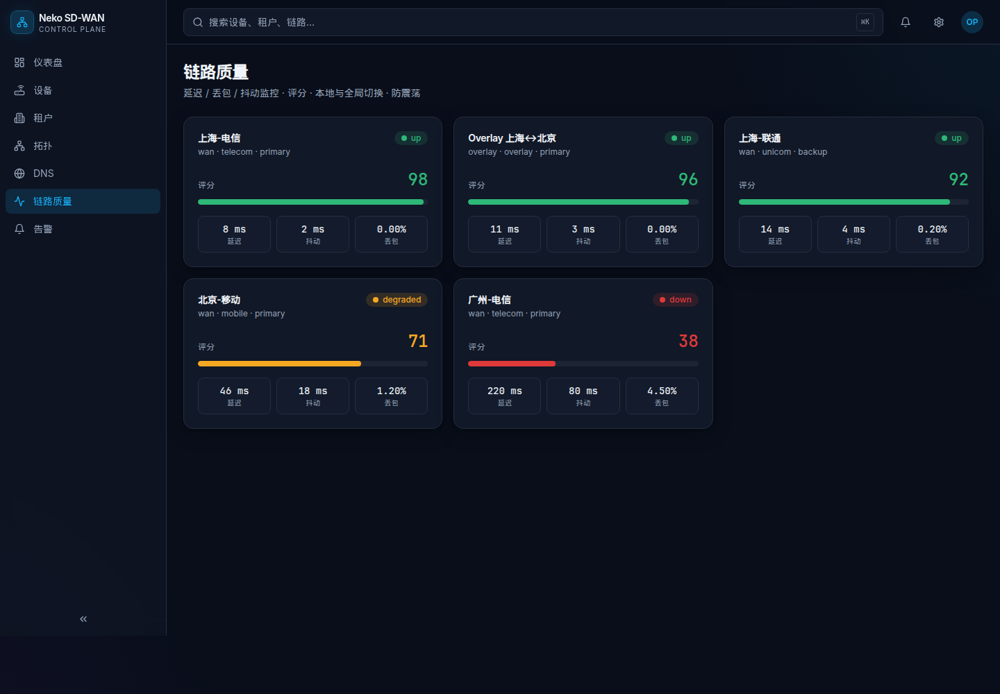
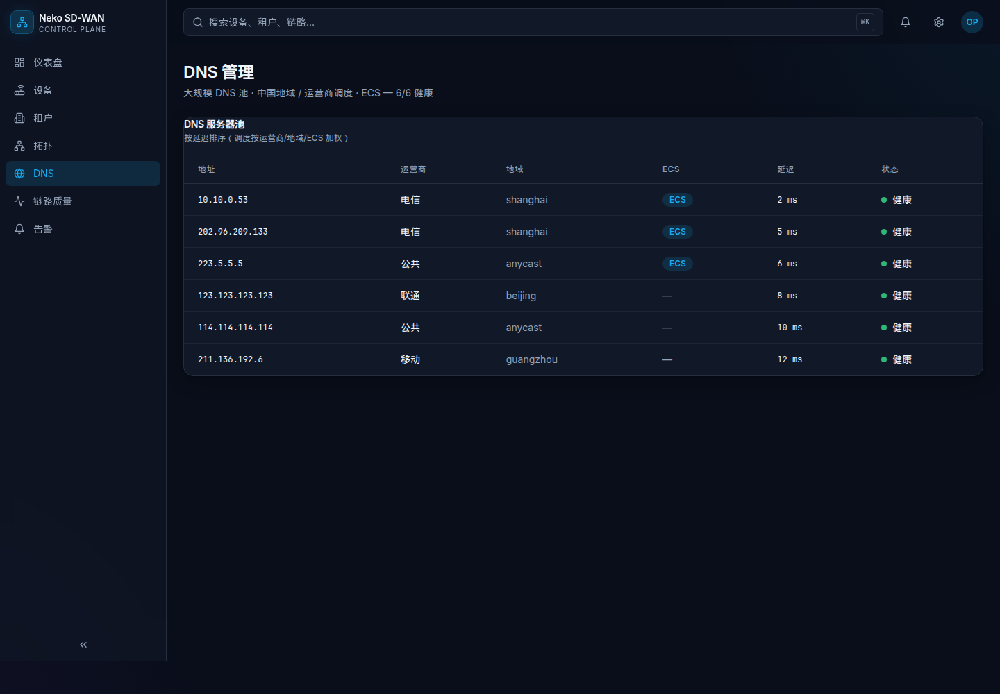

# Neko — RouterOS SD-WAN 平台 🐱

基于 **RouterOS (MikroTik)** 的 SD-WAN 平台，核心业务是**网络加速**与**企业组网**，面向中国复杂网络环境。提供**运营管理端**与**租户端**双门户。

> 🤖 **AI 开发者请先阅读 [`AGENTS.md`](./AGENTS.md)**，它是本仓库唯一权威开发说明书，并从 [`docs/TASKS.md`](./docs/TASKS.md) 持续领取任务。

## 能力概览
- 多租户 + RBAC，严格租户隔离
- 设备纳管：自动识别 RouterBOARD/CHR/x86、版本、架构、License、Device Mode、接口能力（能力矩阵）
- 骨干节点管理：SD-WAN 骨干 POP / 出口网关（均为 RouterOS）统一纳管，按角色/地域组织
- 加速业务模式：智能分流 / **海外运营（全量直连海外出口，不分流）** / 国内直连
- 全功能配置：通过 RouterOS REST 直接下发全量配置（接口/地址/路由/防火墙/NAT/DHCP/DNS/VLAN/隧道/队列/SNMP…），**无需登录设备**
- 配置引擎：Desired State + Diff + 风险分级 + commit-confirm 安全回滚 + Canary 灰度
- SD-WAN 组网：Overlay + 静态/OSPF/BGP（eBGP/iBGP/双 POP/RR/BFD）+ 路由策略与防泄漏
- 原生 SNMP：发现/轮询/接口流量/资源/Trap/告警
- 生命周期：RouterOS/RouterBOOT 升级、设备初始化、接管现网设备
- DNS 管理：大规模 DNS 池 + 中国地域/运营商调度
- 链路质量：延迟/丢包/抖动，多探测，本地+全局切换，主备/自动恢复/防震荡
- 可观测：OpenTelemetry + VictoriaMetrics 大盘

## 技术栈
Go 1.22+（后端/Worker） · Next.js 14 + TypeScript（Web） · PostgreSQL 16 · Redis 7 · NATS JetStream · VictoriaMetrics · OpenTelemetry

## 界面预览

> 以下为 `make demo`（内存仓储 + 演示数据）实际运行截图。需先登录。

| 登录 | 仪表盘 |
| --- | --- |
|  |  |

| 设备纳管 | 租户管理 |
| --- | --- |
|  |  |

| 站点编排 · 一键下发（链路选择 + 路由生成） |
| --- |
|  |

| 链路质量 | DNS 管理 |
| --- | --- |
|  |  |

## 一键本地 Demo 🚀

无需数据库或任何外部依赖（后端使用内存仓储 + 演示数据）：

```bash
make demo
```

启动后访问 http://localhost:3000 ，使用演示账号登录：

| 角色 | 账号 | 密码 |
| --- | --- | --- |
| 平台运营（可见全部租户） | `admin@neko.io` | `neko12345` |
| 租户（仅 Acme Corp） | `ops@acme-corp.com` | `acme12345` |

- API：http://localhost:8080/api/v1 （健康检查 `/healthz`，需 Bearer Token）
- 登录后可：浏览仪表盘/设备/链路/DNS/告警/租户，**新建租户**、**登记设备**，右上角退出登录。
- 演示数据包含 3 个租户、5 台设备（含能力矩阵）、5 条链路（含评分）、3 条告警、6 个 DNS 服务器。按 `Ctrl+C` 停止。

> 前置：本机已安装 Go 1.22+ 与 Node 20+。首次运行会自动 `npm install`（稍慢）。

## 快速开始（分步）

```bash
# 1) 启动依赖（可选，后端默认内存仓储可无依赖运行）
docker compose up -d

# 2) 后端 API（加演示数据用 make backend-run-seed）
cd backend && NEKO_SEED=true go run ./cmd/api
# → http://localhost:8080/healthz

# 3) 前端控制台
cd web && npm install && npm run dev
# → http://localhost:3000

# 统一检查
make check
```

## 生产部署 — Ubuntu 24.04 一键脚本 🚀

在全新的 Ubuntu 24.04 服务器上（root 或 sudo 用户）：

```bash
git clone <repo> neko && cd neko
sudo bash scripts/deploy-ubuntu.sh
```

脚本会自动：

1. 安装 Docker Engine + compose 插件（若缺失）。
2. 生成 `.env`：随机数据库密码、随机管理员密码、按服务器 IP 填充对外地址。
3. 构建并启动全栈（Postgres/Redis/NATS/VictoriaMetrics/OTel + API/Worker/Web）。
4. 等待健康检查，输出控制台地址与**管理员账号密码**。

幂等：重复运行会复用 `.env` 并滚动升级。常用环境变量：

```bash
# 自定义对外地址 / 端口 / 管理员账号 / 是否注入演示数据
PUBLIC_HOST=sdwan.example.com ADMIN_EMAIL=ops@corp.com WITH_DEMO=false \
  sudo -E bash scripts/deploy-ubuntu.sh
```

也可用 `make deploy` / `make deploy-down`。

### 手动部署

```bash
cp .env.example .env   # 按需修改密钥与端口
docker compose -f docker-compose.yml -f docker-compose.deploy.yml up -d --build
```

- API 使用 PostgreSQL（自动迁移 + RLS）、启用鉴权，并暴露 `/metrics` 供 VictoriaMetrics 抓取。
- 后端镜像为 distroless 静态二进制；前端为 Next.js standalone；浏览器访问的 API 地址在前端构建期注入（`NEKO_PUBLIC_API_URL`）。

## 目录结构
见 [`AGENTS.md` §6](./AGENTS.md) 与 [`docs/ARCHITECTURE.md`](./docs/ARCHITECTURE.md)。

## 文档
- [`AGENTS.md`](./AGENTS.md) — AI 自动开发说明书（权威）
- [`docs/TASKS.md`](./docs/TASKS.md) — 任务队列
- [`docs/ARCHITECTURE.md`](./docs/ARCHITECTURE.md) — 架构
- [`docs/DESIGN.md`](./docs/DESIGN.md) — UI/UX 规范
- [`docs/API.md`](./docs/API.md) — API 约定
- [`docs/DECISIONS.md`](./docs/DECISIONS.md) — 架构决策记录

## License
[MIT](./LICENSE)
